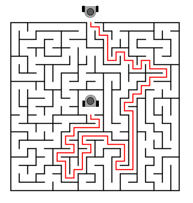
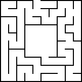
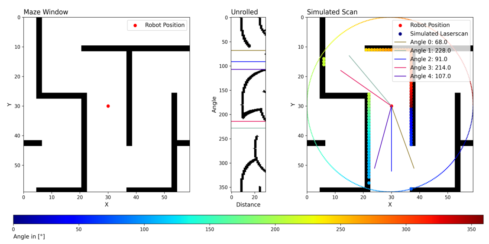
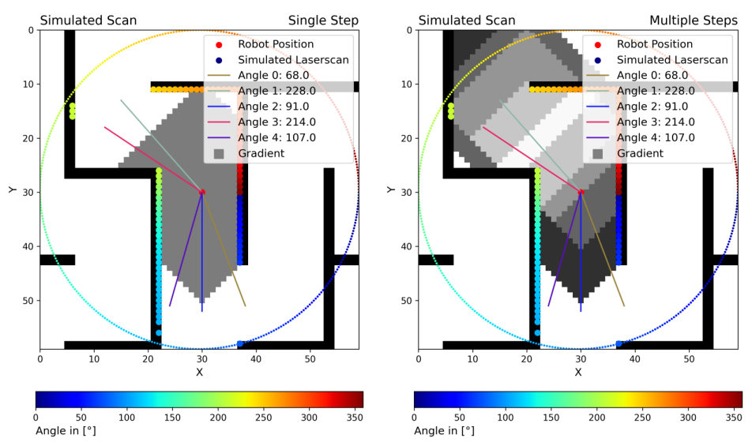

# Maze escape project with Turtlebot3

Project for the lecture FWP: ROS in the Deggendorf Institute of Technology for Summer semester 2023

Professor: Dmitrii Dobriborsc

Group participants:
- Gil Angeles
- Ruben Contreras
- Felix Gatti
- Felipe Rojas

## Project description

The project aim is to develop and implement a search or navigation algorithm that lets the Turtlebot3 solve different kind of maze configurations effectively in a virtual environment.



For the maze escape solution, two scenarios were thought.

### Established scenario 

The established scenario for the project is that the robot has no "knowledge" about the environment. This means, the robot should do some exploration around the maze until it finds its way out.
The maze and the robot are going to be in a simulated environment inside Gazebo. The robot is going to always start in the center of the maze.  It should use the LiDAR sensor to detect its surroundings and to map the maze in RViz.
After the first escape, the map is saved for that specific maze. So, if the robot has to escape from the maze again, it will have a known route for this case.

Several mazes were randomly generated in the following [site.](https://www.mazegenerator.net)
The mazes were then build up inside Gazebo



## Project objectives

### General objectives
- Create a virtual environment inside Gazebo with a Turtlebot3 model "Burger" and a randomly generated maze in it.
- Develop python scripts for the localization of the Robot and mapping the environment around it.
- Implement an algorithm that allows the robot to navigate and map the maze without collision until the robot is out of the maze.
- Save the solution map for the maze and use it again for further escapes of the robot in the same maze.

## Specific objectives

- Simulate a robot in a Python environment.
- Implement a mathematical solution to escape a random maze for the Python simulation.
- With the solution, use an algorithm to identify the path from the exit to the starting point of the robot.
- Create an environment in Gazebo with a Maze that the Turtlebot3 can explore and solve.
- Get readings from the LiDAR sensor scan and 
- Implement the solution found for the Python simulation.
- Make the robot move in the maze based on the radar and map information
- Implement a search algorithm for the Turtlebot3 inside Gazebo so it can get out of the maze in the fastest way possible.


## Python simulation and mathematical solution

The first part of the project was to simulate the maze environment and the robot behaviour in a Python environment. 

### Maze simulation and LiDAR scan simulation
The robot uses a Lidar scan sensor to perceive its surroundings. The maze environment was replicated in a Python environment to test the maze-escape logic. This was done in a [Jupyter Notebook](test/Pure-Simulation/FWP_ROS-03-Explorations_w_BorderExtend.ipynb).
Using images from random-generated mazes using the website [Maze Generator](https://www.mazegenerator.net), a "robot" is located in the middle of the image.
Emulating how a Lidar sensor works, the robot will scan its surroudings, generating a list of values with the distance of objects around the robot, limited by a scan range. 



### Path planning logic
To explore and navigate through the maze, a logic for optimal paths was implemented. From the list of points returned by the Lidar scan, they are split depending on "open spaces" detected in the list. It is considered an open space if the value in the list is equal to the maximum range of the lidar scan (This means no object was detected inside the scan range). 
For each of the sections with walls, a local minima is calculated as the most optimal point to move. In the case of open spaces, the center point of if will be considered as the most optimal point to move.

### Exploration



## Gazebo implementation

For the Gazebo implementation, we made two launch files:

- Turtlebot3_maze.launch: For the Gazebo world with the turtlebot3 in the middle of the world.
- turtlebot3_navigation.launch For the Rviz launch and the Move Base navigation package.

### Project setup
The project was originally made inside a Docker container with the following characteristics

#### Requirements:
- Ubuntu 20.04.6 LTS (Focal)
- ROS Noetic Ninjemys
- Gazebo 11
- RViz
- Python 3.9

#### Environment setup
Make sure the model is the burger with the following command
```
export TURTLEBOT3_MODEL="burger"

```

To setup the Gazebo environment with the Rviz and the required ROS packages, run the following launch files:
```
roslaunch /turtlebot3_final_project/turtlebot3_maze.launch
roslaunch /turtlebot3_final_project/turtlebot3_navigation.launch

```

Gazebo should open with the Maze and the Turtlebot3 robot in the middle of it. Also Rviz should be open, and mapping the surroundings of the robot.


## Results

## Conclusion
