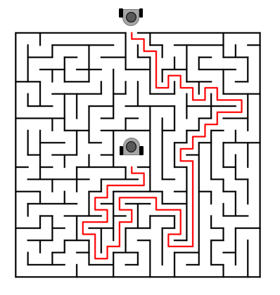
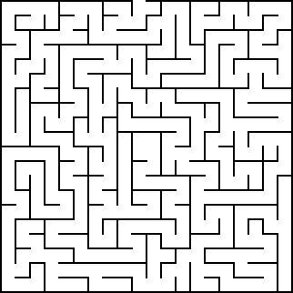

# Maze escape project with Turtlebot3

Project for the lecture FWP: ROS in the Deggendorf Institute of Technology for Summer semester 2023

Professor: Dmitrii Dobriborsc

Group participants:
- Gil Angeles
- Ruben Contreras
- Felix Gatti
- Felipe Rojas

## Project description

The project aim is to develop and implement a search or navigation algorithm that lets the Turtlebot3 solve different kind of maze configurations effectively in a virtual environment.

For the maze escape solution, two scenarios were thought.

### First scenario

The first scenario supposes that the robot has no "knowledge" about the environment. This means, it was to explore everything until it finds and exit of the maze.
For subsequent escapes from the maze, the robot will already "know" its way inside the maze and escape in much less time.

### Second scenario

For the second scenario, the robot has some information about the location of the exit. In this approach, the robot will try to escape while minimizing the exploration and the time inside the maze.

## General objectives

- Create an environment in Gazebo with a Maze that the Turtlebot3 can explore and solve.

- Defining a localization/mapping method to navigate the maze in an ordered behaviour.

- Implement a search algorithm for the Turtlebot3 so it can get out of the maze in the fastest way possible.

- Implement the same algorithm in a Real-world scenario, where a Physical Turtlebot3 is able to solve a simple maze.

## Project components

This project uses the Turtlebot3 Burger robot, and its different components like:
- Laser Distance Sensors LS - 01 (LiDAR sensor)
- 

### Maze

Two mazes were randomly generated in the following [site.](https://www.mazegenerator.net)
The mazes were then build up inside Gazebo

### Navigation

### Escape algorithm

